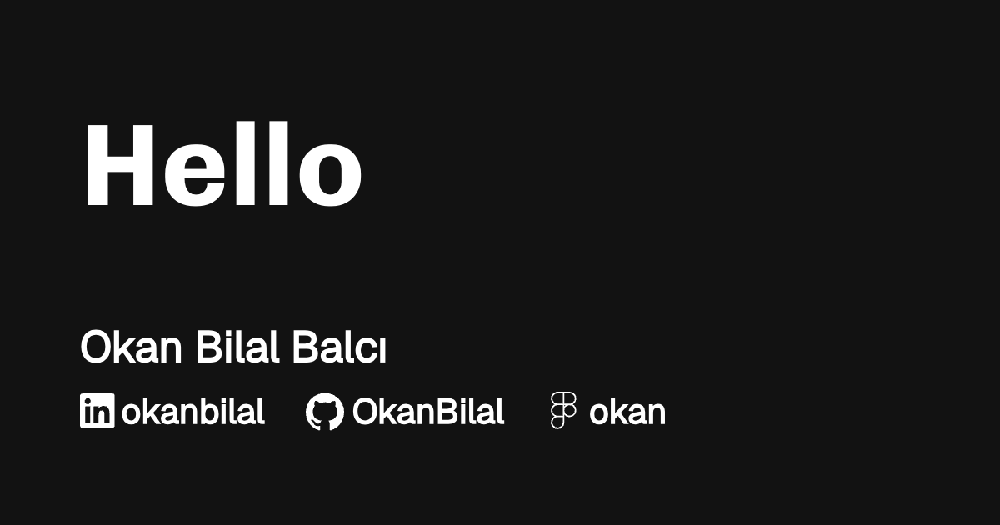

# og-image-generator

Generate Open Graph images that you can embed in your `<meta>` tag of your web pages.

## Features

- Customizable title and author fields.
- Several optional social media fields.
- Over 30 font options.
- Customize foreground and background colour (with WCAG 2.0 contrast checking).
- Generates a `.png` with a unique file name based on title.
- Optimized for readability and mobile viewports.
- Dynamic text scaling based on character count.

## Setup

1. Clone the repository
2. Install dependencies:
```bash
npm install
```
3. Run the development server:
```bash
npm run dev
```

## Open Graph Image

Open Graph is an internet protocol that was originally created by Facebook to standardize the use of metadata within a webpage to represent the content of a page.

Within it, you can provide details as simple as the title of a page or as specific as the duration of a video. These pieces all fit together to form a representation of each individual page of the internet. Learn more: [What is Open Graph and how can I use it for my website?](https://www.freecodecamp.org/news/what-is-open-graph-and-how-can-i-use-it-for-my-website/)

To use open graph image protocol, place the `<meta>` tag in the `<head>` of your web page.

```html
<head>
  <meta property="og:image" content="http://examplewebsite.com/image.png" />
</head>
```

## Example

<p align="left">
  
</p>

